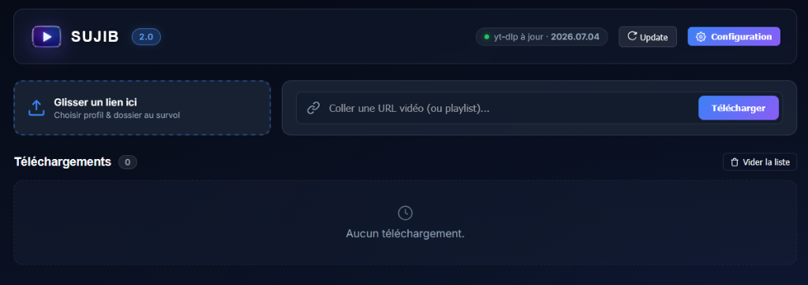

# Sujib (수집) — YouTube Video Download Manager v2.0

[Version Française / Lire en Français](README-FR.md)

<div align="center">
  
  <br><br>
  <p><strong>A modern, high-performance, and sleek web-based YouTube download manager powered by Python (FastAPI), yt-dlp, and FFmpeg.</strong></p>
</div>

---

## 🌟 Key Features (v2.0)

- **⚡ Modern Python Backend**: High-performance asynchronous backend powered by **FastAPI** and **uvicorn**, with native integration of the internal `yt-dlp` API and progress hooks.
- **🎨 Sober & Sleek Dark UI (Sujib 2.0)**: Glassmorphism design with modern typography, subtle micro-animations, and sober vector SVG stroke icons (no cartoon emojis).
- **🎯 Smart Drag & Drop Zone**: Drop any YouTube video or playlist link directly onto the drop zone to dynamically pick quality profiles and destination folders on hover.
- **📁 Custom Destination Presets**: Define custom target directories (*US Albums, K-Pop MVs, EDM, Documentaries...*) and route downloads directly to the right disk location.
- **🎛️ Dynamic Quality Profiles**: Create and customize quality profiles (4K, 1440p, 1080p, 720p, MP3 Audio-Only...) with tailored `yt-dlp -f` selector formulas.
- **📊 Comprehensive Technical Media Specs**: Automatic extraction and chip display of video/audio codecs (`H264`, `VP9`, `AV1`, `AAC`, `Opus`), bitrate, framerate (`60 fps`), resolution, and file size via `ffprobe`.
- **✏️ Manual Post-Download Renaming & Regex Engine**: Automatic title cleaning via regex replacement rules (`pattern||replacement`) + interactive manual rename button directly modifying physical files on disk and in database.
- **🗑️ Controlled Deletion**: Interactive modal offering the choice to delete the physical file from disk + clear list, or remove entry from history only.
- **📋 Playlist Inspector & Multi-Select**: Interactive modal to inspect, select, or filter individual videos inside YouTube playlists before queuing.
- **🔄 1-Click yt-dlp Auto-Updater**: Check and update `yt-dlp` in background directly from the top navigation bar.
- **🦊 Firefox WebExtension v2.0**: 1-click companion extension to send videos or playlists to your private Sujib server with instant profile & destination path selection.

---

## 🏗️ Project Architecture

```text
sujib/
├── main.py                    # FastAPI REST API & Server-Sent Events (SSE) stream
├── downloader.py              # Async download queue worker & yt-dlp/ffprobe engine
├── database.py                # SQLite schema, queries, and history management
├── updater.py                 # In-app background yt-dlp update manager
├── requirements.txt           # Python dependencies (FastAPI, yt-dlp, uvicorn...)
├── sujib.service              # Systemd service unit configuration file
├── docs/
│   └── screenshot.png         # Official v2.0 screenshot
├── extension/                 # Firefox WebExtension v2.0 source files
│   ├── manifest.json
│   ├── background.js
│   ├── popup.html / popup.js
│   ├── options.html / options.js
│   └── icons/
└── static/                    # Single-Page Application (SPA) frontend
    ├── index.html
    ├── css/style.css
    ├── js/app.js
    └── installers/            # Automated setup scripts
```

---

## 🚀 Installation & Deployment

### 1. Prerequisites
- **Linux** (Debian, Ubuntu, Arch, Fedora...) or Windows / macOS
- **Python 3.10+**
- **FFmpeg** & **FFprobe** installed (`sudo apt install ffmpeg`)

### 2. Application Setup
```bash
# Clone the repository
git clone https://github.com/mediapixelkr/Sujib.git /var/www/html/sujib
cd /var/www/html/sujib

# Create Python virtual environment
python3 -m venv venv
source venv/bin/activate

# Install dependencies
pip install --upgrade pip
pip install -r requirements.txt
```

### 3. Systemd Service Setup (Linux)
To run Sujib as a persistent background service:

```bash
# Copy systemd unit file
sudo cp sujib.service /etc/systemd/system/
sudo systemctl daemon-reload
sudo systemctl enable --now sujib.service
```

### 4. Nginx Reverse Proxy Configuration
Add the following block to your Nginx site configuration (`/etc/nginx/sites-available/default`):

```nginx
location /sujib/ {
    proxy_pass http://127.0.0.1:8000/;
    proxy_http_version 1.1;
    proxy_set_header Host $host;
    proxy_set_header X-Real-IP $remote_addr;
    proxy_set_header X-Forwarded-For $proxy_add_x_forwarded_for;
    proxy_set_header X-Forwarded-Proto $scheme;
    proxy_set_header Connection '';
    proxy_buffering off;
    proxy_cache off;
    proxy_read_timeout 86400s;
}
```

Reload Nginx:
```bash
sudo nginx -t && sudo systemctl reload nginx
```

---

## 🦊 Firefox Extension (v2.0)

The Firefox extension allows you to send any YouTube video or playlist directly to your Sujib server with one click.

### Installation:
1. **Via `about:debugging` (Immediate Local Add-on)**:
   - Download the archive **`static/sujib-firefox-extension.zip`** and extract it.
   - In Firefox, navigate to `about:debugging#/runtime/this-firefox`.
   - Click **"Load Temporary Add-on..."** and select `manifest.json`.
2. **Configuration**:
   - Click on the Sujib icon in the Firefox toolbar $\rightarrow$ **Options**.
   - Set your server URL (e.g., `http://192.168.200.15/sujib`).
   - Your profiles and custom destination paths are dynamically synchronized in real-time!

---

## ⚙️ Configuration & Customization

Click on the **Configuration** button at the top right of the web interface:
- **Preset Paths**: Add your favorite destination directories with a label and absolute path.
- **Quality Profiles**: Customize containers (MKV, MP4, WebM, MP3) and `yt-dlp -f` format arguments.
- **Regex Renaming Rules**: Automatically clean noisy video titles (e.g., stripping `[Official Video]`, standardizing hyphens and quotes).
- **Subtitles**: Enable automatic subtitle downloading as external `.srt` or embedded inside video streams.

---

## 📜 License

Distributed under the MIT License. Developed for simple, fast, and self-hosted media management.
